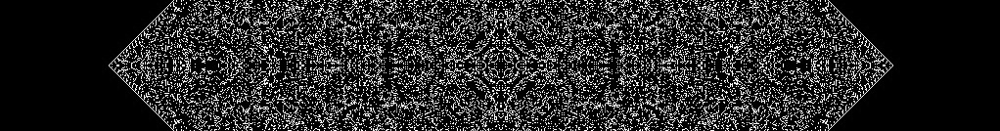

# Cellular Automata Simulator in C

This is a general-purpose simulator for cellular automata written in C. The program allows you to specify the size of the grid, the rule set to use, and the number of iterations to run.

## Usage

To build the program, run `make all`. This will create an executable file named `automata`.

To run the program, use the following command:

```
./automata [-s <size>] [-r <rule>] [-i <iterations>] [-a] [-p]
```

- `-s <size>`: Sets the size of the grid. The default value is 512.
- `-r <rule>`: Specifies the rule set to use. The default is "Conway's Game of Life".
- `-i <iterations>`: Specifies the number of generations to run. The default is 100.
- `-a`: simulate in SDL, generate new generation with 'Q' key
- `-p`: save last generation to a .ppm file

The following is a valid command that simulates the maze life in SDL and saves the last generation to a .ppm file:

```
./automata -s 748 -r maze -a -p
```

You can not modify the [noise](noise.jpeg), only if you tweak the code, because it would have made the running a bit cloudy with all the optional settings. I also recommend you to simulate the "Seeds" cellular automata with the plant_seed() function, because that is where it really shines. I did not account for all error cases, so make sure you use the correct flags.

## Rule Sets

The following rule sets are currently supported:

- "Conway's Game of Life" (flag: conway)
- "Seeds" (flag: seeds)
- "Brians brain" (flag: brian)
- "HighLife" (flag: high)
- "Maze" (flag: maze)
- "Day & Night" (flag: daynight)
- "Move" (flag: move)

## License

This project is licensed under the terms of the [MIT license](license.md). The code I used for noise generation can be found here: https://github.com/Auburn/FastNoiseLite
